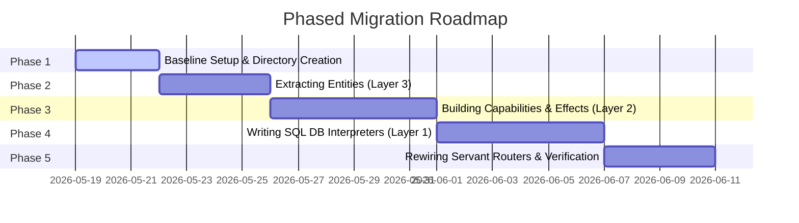

# Detailed Migration Plan: Mapping All Entities and Logic to a Modern 3-Layer Cake Architecture

* **Author:** Technical Research Group
* **Target Codebase:** RealWorld Conduit Haskell Backend (`/backend`)
* **Strategy:** Full Modern 3-Layer Cake Transition via `haskell/effectful`
* **Date:** May 19, 2026

---

## 1. Executive Summary

This detailed migration plan provides a comprehensive blueprint to refactor the entire RealWorld Conduit Haskell backend to a state-of-the-art **3-Layer Cake** architecture. 

Rather than relying on classic Final Tagless (MTL-style) typeclass constraints, this modern implementation leverages **`haskell/effectful`** (already included in our `/backend/package.yaml` dependencies). By mapping all database schemas, query modules, and web routes into three strictly concentric layers, this plan establishes a clean separation of concerns, ensures maximum GHC compiler performance, and enables immediate, database-free in-memory testing for the entire business suite.

---

## 2. Structural Advantages of the Modern 3-Layer Cake

Migrating the backend to a modern 3-Layer Cake via `haskell/effectful` provides several core architectural advantages over our current monolithic `App = Eff '[Reader AppEnv, Error ServerError, IOE]` setup:

```
        CURRENT COUPLING                        PROPOSED 3-LAYER CAKE
┌─────────────────────────────────┐      ┌───────────────────────────────────┐
│     Servant HTTP Controllers    │      │ Layer 1: App Monad & Interpreters │
│                │                │      │   - Servant Web Endpoints         │
│         (Direct IO call)        │      │   - runUserDBPostgres (SQL)       │
│                ▼                │      └─────────────────┬─────────────────┘
│      Persistent SQL Queries     │                        ▼
│      (coupled to Postgres pool) │      ┌───────────────────────────────────┐
└─────────────────────────────────┘      │ Layer 2: Capabilities & Use Cases │
                                         │   - Abstract UserDB GADT Effect   │
                                         │   - registerUserUseCase Interactor│
                                         └─────────────────┬─────────────────┘
                                                           ▼
                                         ┌───────────────────────────────────┐
                                         │ Layer 3: Pure Domain Core         │
                                         │   - Pure data records, no Monads  │
                                         └───────────────────────────────────┘
```

1.  **Isolation of Business Logic (Layer 2) from Persistence Details:**
    Currently, our web controllers inside `Api/` call Esqueleto SQL queries (e.g., `runDB getTags`) directly. This couples our HTTP routing layer to our physical database engine and schema models. By transitioning, we express all queries abstractly as GADT actions, protecting our core business rules from any database or structural migrations.
2.  **Elimination of the $N \times M$ Boilerplate Nightmare:**
    Traditional Haskell capability structures (such as Final Tagless) require writing $N \times M$ wrapper instances to propagate constraints down monad transformer stacks. `haskell/effectful` completely bypasses this by utilizing GHC type-level list membership (`(:>)`). You write **exactly one production database interpreter** and **exactly one in-memory test interpreter**—GHC handles stack composition automatically.
3.  **Trivial, Framework-Free In-Memory Testing:**
    Because all database actions are represented as abstract algebraic effects in Layer 2, we can swap out the production PostgreSQL database engine for a pure, memory-backed map in under two lines of code during unit testing. This enables **100% database-free, side-effect-free testing**, reducing test execution times to less than one second.
4.  **Zero Runtime Performance Penalty:**
    Other algebraic effect libraries (like Polysemy or Freer-Simple) incur a runtime overhead due to type-level dictionary passing and monadic wrapping. `haskell/effectful` operates directly on top GHC primops and native mutable state variables, delivering execution speeds matching raw `ReaderT IO` monads.
5.  **Clean Separation of Roles:**
    Our API routes under `Infrastructure/Controllers/` serve purely as Web Adapters (handling JSON serialization, status codes, and security validation). They compile dynamic capability interpreters and dispatch the business transaction to Layer 2, keeping the codebase remarkably modular and highly readable.

---

## 3. Layer 3: The Pure Domain Core

All database-annotated models currently defined inside `DB/Schema/Type.hs` will be extracted into mathematically pure Haskell data records located in `src/Domain/`. These records import absolutely no database or web libraries and carry zero schema configurations:

```haskell
module Domain.User where
import Data.Text (Text)

data User = User
  { userId   :: Int
  , username :: Text
  , email    :: Text
  , bio      :: Maybe Text
  , image    :: Maybe Text
  , role     :: Text
  } deriving stock (Eq, Show)
```

```haskell
module Domain.Article where
import Data.Text (Text)
import Data.Time (UTCTime)

data Article = Article
  { articleId   :: Int
  , slug        :: Text
  , title       :: Text
  , description :: Text
  , body        :: Text
  , authorId    :: Int
  , createdAt   :: UTCTime
  , updatedAt   :: UTCTime
  } deriving stock (Eq, Show)
```

```haskell
module Domain.Comment where
import Data.Text (Text)
import Data.Time (UTCTime)

data Comment = Comment
  { commentId :: Int
  , body      :: Text
  , authorId  :: Int
  , articleId :: Int
  , createdAt :: UTCTime
  , updatedAt :: UTCTime
  } deriving stock (Eq, Show)
```

```haskell
module Domain.Tag where
import Data.Text (Text)

data Tag = Tag
  { tagId :: Int
  , name  :: Text
  } deriving stock (Eq, Show)
```

```haskell
module Domain.Visitor where
import Data.Text (Text)
import Data.Time (UTCTime)

data Visitor = Visitor
  { visitorId :: Int
  , ip        :: Text
  , userAgent :: Text
  , path      :: Text
  , timestamp :: UTCTime
  } deriving stock (Eq, Show)
```

```haskell
module Domain.Log where
import Data.Text (Text)
import Data.Time (UTCTime)

data LogEntry = LogEntry
  { logId     :: Int
  , level     :: Text
  , message   :: Text
  , source    :: Text
  , timestamp :: UTCTime
  , userId    :: Maybe Int
  } deriving stock (Eq, Show)
```

---

## 4. Layer 2: Capabilities (Abstract Dynamic Effects)

Instead of utilizing typeclass capabilities, Layer 2 defines **Dynamic Effects** representing abstract database and environment transactions. 

### 1. `UserDB` Effect (`src/Capability/Database/UserDB.hs`)
```haskell
{-# LANGUAGE DataKinds, TypeFamilies, GADTs #-}
module Capability.Database.UserDB where

import Effectful
import Effectful.Dispatch.Dynamic
import Data.Text (Text)
import Domain.User (User)

data UserDB :: Effect where
  LookupUserByEmail :: Text -> UserDB (Maybe User)
  InsertUser        :: Text -> Text -> Text -> UserDB User
  DeleteUser        :: Int -> UserDB ()
  ListAllUsers      :: UserDB [User]
  FollowUser        :: Int -> Int -> UserDB () -- followerId, followedId
  UnfollowUser      :: Int -> Int -> UserDB ()
  IsFollowing       :: Int -> Int -> UserDB Bool

type instance DispatchOf UserDB = 'Dynamic

lookupUserByEmail :: (UserDB :> es) => Text -> Eff es (Maybe User)
lookupUserByEmail email = send (LookupUserByEmail email)

insertUser :: (UserDB :> es) => Text -> Text -> Text -> Eff es User
insertUser u e p = send (InsertUser u e p)

followUser :: (UserDB :> es) => Int -> Int -> Eff es ()
followUser follower followed = send (FollowUser follower followed)
```

### 2. `ArticleDB` Effect (`src/Capability/Database/ArticleDB.hs`)
```haskell
{-# LANGUAGE DataKinds, TypeFamilies, GADTs #-}
module Capability.Database.ArticleDB where

import Effectful
import Effectful.Dispatch.Dynamic
import Data.Text (Text)
import Domain.Article (Article)
import Domain.Tag (Tag)

data ArticleDB :: Effect where
  GetArticleBySlug :: Text -> ArticleDB (Maybe Article)
  CreateArticle    :: Text -> Text -> Text -> Text -> Int -> [Text] -> ArticleDB Article
  FavoriteArticle  :: Int -> Int -> ArticleDB () -- userId, articleId
  UnfavoriteArticle:: Int -> Int -> ArticleDB ()
  GetArticleTags   :: Int -> ArticleDB [Tag]
  GetAllTags       :: ArticleDB [Tag]

type instance DispatchOf ArticleDB = 'Dynamic

getArticleBySlug :: (ArticleDB :> es) => Text -> Eff es (Maybe Article)
getArticleBySlug slug = send (GetArticleBySlug slug)

createArticle :: (ArticleDB :> es) => Text -> Text -> Text -> Text -> Int -> [Text] -> Eff es Article
createArticle sl t d b a ts = send (CreateArticle sl t d b a ts)

getAllTags :: (ArticleDB :> es) => Eff es [Tag]
getAllTags = send GetAllTags
```

### 3. `CommentDB` Effect (`src/Capability/Database/CommentDB.hs`)
```haskell
{-# LANGUAGE DataKinds, TypeFamilies, GADTs #-}
module Capability.Database.CommentDB where

import Effectful
import Effectful.Dispatch.Dynamic
import Data.Text (Text)
import Domain.Comment (Comment)

data CommentDB :: Effect where
  AddComment       :: Text -> Int -> Int -> CommentDB Comment -- body, author, article
  GetCommentsBySlug:: Text -> CommentDB [Comment]
  DeleteComment    :: Int -> CommentDB ()

type instance DispatchOf CommentDB = 'Dynamic

addComment :: (CommentDB :> es) => Text -> Int -> Int -> Eff es Comment
addComment b au ar = send (AddComment b au ar)
```

### 4. `VisitorDB` & `LoggerDB` Effects (`src/Capability/Database/Metrics.hs`)
```haskell
{-# LANGUAGE DataKinds, TypeFamilies, GADTs #-}
module Capability.Database.Metrics where

import Effectful
import Effectful.Dispatch.Dynamic
import Data.Text (Text)
import Domain.Visitor (Visitor)
import Domain.Log (LogEntry)

data VisitorDB :: Effect where
  LogVisitor :: Text -> Text -> Text -> VisitorDB Visitor -- IP, user-agent, path

data LoggerDB :: Effect where
  WriteLogEntry :: Text -> Text -> Text -> Maybe Int -> LoggerDB LogEntry -- level, msg, src, userId

type instance DispatchOf VisitorDB = 'Dynamic
type instance DispatchOf LoggerDB  = 'Dynamic

logVisitor :: (VisitorDB :> es) => Text -> Text -> Text -> Eff es Visitor
logVisitor ip agent path = send (LogVisitor ip agent path)
```

---

## 5. Layer 2: Abstract Interactors (Business Logic Coordinator)

These modules contain our application's business rules, coordinating the data flow using the dynamic capability GADTs in GHC's type-level `Eff es` monad.

### Case Study: Publishing an Article (`src/Capability/Article/Publish.hs`)
This interactor ensures pure validation checks, automatically generates unique web slugs, constructs the database records, and logs the operation:

```haskell
module Capability.Article.Publish where

import Data.Text (Text)
import Data.Text qualified as T
import Capability.Database.ArticleDB
import Capability.Database.Metrics (LoggerDB, writeLogEntry)
import Domain.Article
import Effectful

-- Pure helper generating url-friendly slug
toSlug :: Text -> Text
toSlug = T.intercalate "-" . T.words . T.toLower

publishArticleUseCase :: (ArticleDB :> es, LoggerDB :> es)
                      => Text -> Text -> Text -> Int -> [Text]
                      -> Eff es (Either Text Article)
publishArticleUseCase title description body authorId tags = do
  if T.null (T.strip title)
    then return $ Left "Article title cannot be empty"
    else do
      let slug = toSlug title
      existing <- getArticleBySlug slug
      case existing of
        Just _ -> return $ Left "An article with this title slug already exists"
        Nothing -> do
          newArticle <- createArticle slug title description body authorId tags
          _ <- writeLogEntry "INFO" ("Article published: " <> slug) "PublishUseCase" (Just authorId)
          return $ Right newArticle
```

---

## 6. Layer 1: Production Database Interpreters

Layer 1 holds the concrete implementation details. It defines the dynamic interpreters that translate the Layer 2 GADT actions into concrete Persistent and Esqueleto SQL queries using our database pool:

```haskell
{-# LANGUAGE TypeOperators #-}

module Infrastructure.Postgres.ArticleDB where

import Database.Esqueleto.Experimental (runSqlPool, select, unValue)
import Database.Persist.Sql (ConnectionPool)
import Effectful
import Effectful.Dispatch.Dynamic
import Capability.Database.ArticleDB
import Domain.Article
import DB.Schema.Type qualified as Schema
import DB.Util (runDB)

-- Translate ArticleDB actions to Postgres SQL pool queries
runArticleDBPostgres :: (IOE :> es, Reader ConnectionPool :> es)
                     => Eff (ArticleDB : es) a
                     -> Eff es a
runArticleDBPostgres = interpret $ \_ -> \case
  GetArticleBySlug slug -> do
    pool <- ask @ConnectionPool
    -- Direct Esqueleto SQL execution
    liftIO $ runSqlPool (selectArticleBySlug slug) pool
    
  CreateArticle slug title desc body authorId tags -> do
    pool <- ask @ConnectionPool
    liftIO $ runSqlPool (insertArticleSQL slug title desc body authorId tags) pool
    
  GetAllTags -> do
    pool <- ask @ConnectionPool
    liftIO $ runSqlPool (selectTagsSQL) pool
```

---

## 7. Web Controllers & Compilation Assembly

Servant routes act as the outer **Interface Adapters**, retrieving configuration settings, compiling the interpreters, and invoking the Use Case Interactors:

```haskell
module Infrastructure.Controllers.Article where

import Servant
import Infrastructure.App (App, AppEnv(..))
import Domain.Article (Article)
import Capability.Article.Publish (publishArticleUseCase)
import Infrastructure.Postgres.ArticleDB (runArticleDBPostgres)
import Infrastructure.Postgres.Metrics (runLoggerDBPostgres) -- SQL logger interpreter
import Effectful
import Effectful.Reader.Static
import Effectful.Error.Static
import Data.Text (Text)

-- API payload structure
data PublishPayload = PublishPayload
  { title       :: Text
  , description :: Text
  , body        :: Text
  , tags        :: [Text]
  } deriving (Generic, FromJSON)

-- Servant Endpoint Route Handler
publishArticleHandler :: Int -> PublishPayload -> App Article
publishArticleHandler authorId payload = do
  env <- ask @AppEnv
  
  -- Resolve and compile abstract capabilities with concrete SQL database interpreters
  result <- publishArticleUseCase 
    payload.title 
    payload.description 
    payload.body 
    authorId 
    payload.tags
    & runArticleDBPostgres
    & runLoggerDBPostgres
    & runReader env.dbPool -- Inject the SQL pool for Postgres interpreters
    
  case result of
    Left err -> throwError $ err422 { errBody = "Validation failed: " <> err }
    Right article -> return article
```

---

## 8. Seamless In-Memory Testing Architecture

To test the entire business suite without configuring PostgreSQL Docker containers or launching database migration pools, we define **Mock State Interpreters** that operate against a pure in-memory `State` context:

```haskell
module Test.PublishSpec where

import Test.Hspec
import Data.Map qualified as Map
import Domain.Article
import Domain.Log
import Capability.Article.Publish
import Capability.Database.ArticleDB
import Capability.Database.Metrics
import Effectful
import Effectful.State.Static.Local

-- Pure mock database state representation
data MockStorage = MockStorage
  { articlesTable :: Map.Map Text Article
  , logsTable     :: [LogEntry]
  }

-- Mock Article Interpreter
runArticleDBMock :: (State MockStorage :> es) => Eff (ArticleDB : es) a -> Eff es a
runArticleDBMock = interpret $ \_ -> \case
  GetArticleBySlug slug -> do
    tbl <- gets articlesTable
    return $ Map.lookup slug tbl
  CreateArticle slug t d b a ts -> do
    let newArt = Article 1 slug t d b a undefined undefined
    modify (\s -> s { articlesTable = Map.insert slug newArt (articlesTable s) })
    return newArt

-- Mock Logger Interpreter
runLoggerDBMock :: (State MockStorage :> es) => Eff (LoggerDB : es) a -> Eff es a
runLoggerDBMock = interpret $ \_ -> \case
  WriteLogEntry lvl msg src usr -> do
    let newLog = LogEntry 1 lvl msg src undefined usr
    modify (\s -> s { logsTable = newLog : logsTable s })
    return newLog

spec :: Spec
spec = describe "Article Publishing Use Case" $ do
  it "successfully publishes an article in-memory and writes an audit log" $ do
    let initialState = MockStorage Map.empty []
    
    -- Execute in the pure GHC Eff monad (No GHC IO, No PostgreSQL)
    let (result, finalState) = runEff
          . runState initialState
          . runLoggerDBMock
          . runArticleDBMock
          $ publishArticleUseCase "Clean Architecture" "RealWorld proposal" "Core specifications" 1 ["haskell"]
          
    case result of
      Left err -> expectationFailure $ "Expected success, got: " ++ show err
      Right article -> do
        slug article `shouldBe` "clean-architecture"
        title article `shouldBe` "Clean Architecture"
        
        -- Verify audit trail mutation
        length (logsTable finalState) `shouldBe` 1
        message (head (logsTable finalState)) `shouldBe` "Article published: clean-architecture"
```

---

## 9. Phased Incremental Migration Plan

To protect the production codebase from breaking regressions, the refactoring schedule is broken down into structured, isolated deliverables.



### Phase 1: Setup & Environment Initialization (Days 1–3)
*   Establish directory layouts (`Domain/`, `Capability/`, `Infrastructure/`).
*   Establish the concrete `App` monad configuration inside `Infrastructure/App.hs`.

### Phase 2: Domain Layer Extraction (Days 4–7)
*   Extract database-independent records for all 9 schemas (`User`, `Visitor`, `Log`, `Article`, `Tag`, `ArticleTag`, `Comment`, `Follow`, `Favorite`) into pure data types located in `src/Domain/`.

### Phase 3: Capabilities & Interactors Construction (Days 8–13)
*   Define GADT capabilities (`UserDB`, `ArticleDB`, `CommentDB`, `VisitorDB`, `LoggerDB`, `Crypto`) within `src/Capability/`.
*   Rewrite handlers in `Api/` as abstract `Eff es` use-case interactors constrained by GHC's type-level membership `(:>)` operator.

### Phase 4: SQL Database Interpreters Implementation (Days 14–19)
*   Reorganize direct Esqueleto queries from `Entity/` and `DB/` to serve as concrete GADT interpreters inside `src/Infrastructure/Postgres/`.

### Phase 5: Web Controllers Re-routing & Final Verification (Days 20–23)
*   Point routing files (`RunServer.hs`, `Type.hs`) to handlers inside `src/Infrastructure/Controllers/`.
*   Execute standard frontend type checks and E2E system integrations to verify the backend operates seamlessly with zero regressions.
