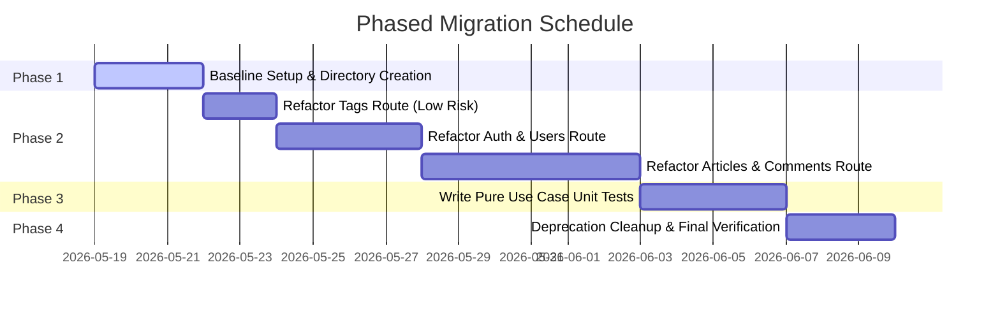

# Migration Plan: Adopting Functional Clean Architecture in the RealWorld Backend

* **Author:** Technical Research Group
* **Target Codebase:** RealWorld Conduit Haskell Backend (`/backend`)
* **Strategy:** Decoupling via Higher-Order Functions & the Handle Pattern (Revisited Paradigm)
* **Date:** May 19, 2026

---

## 1. Objective

This migration plan outlines a step-by-step technical strategy to refactor the current RealWorld Haskell backend from its monolithic `effectful` structure to a strict **Functional Clean Architecture**. 

Following the paradigm described in *"Clean Architecture Revisited"*, we will enforce the Clean Architecture **Dependency Rule** by parameterizing our business logic with its dependencies. Rather than adopting heavy type-level algebraic effect engines (such as Polysemy), we will utilize vanilla Haskell **higher-order functions** and the **Handle Pattern** (Record of Functions) to achieve complete, database-free unit testability and strict separation of concerns with zero performance overhead.

---

## 2. Target Architectural Layout

The codebase will be reorganized into four concentric layers. Direct dependencies will only flow inward:

```
src/
├── Domain/                           -- Innermost: Pure records and validation rules
│   ├── User.hs                       -- Pure User data records
│   ├── Article.hs                    -- Pure Article structures
│   └── Tag.hs                        -- Pure Tag models
│
├── UseCases/                         -- Application business rules & interface types
│   ├── User/
│   │   ├── Service.hs                -- UserService handle record type
│   │   ├── Authenticate.hs           -- Authentication use case interactor
│   │   └── Register.hs               -- Registration use case interactor
│   └── Article/
│       ├── Service.hs                -- ArticleService handle record type
│       └── Favorite.hs               -- Favorite action use case interactor
│
├── InterfaceAdapters/                -- Protocol translators
│   ├── Controllers/                  -- Servant controllers (Web Routing)
│   │   ├── User.hs                   -- Binds live database queries to User use cases
│   │   └── Article.hs                -- Binds live database queries to Article use cases
│   └── Repositories/                 -- Concrete Database execution logic
│       └── Postgres/
│           ├── User.hs               -- Direct Esqueleto/Persistent queries for Users
│           └── Article.hs            -- Direct Esqueleto/Persistent queries for Articles
│
└── ExternalInterfaces/               -- Outermost: Infrastructure details
    ├── Main.hs                       -- Warp startup, CLI execution, config parsing
    └── RunServer.hs                  -- Server startup and environment building
```

---

## 3. Step-by-Step Migration Roadmap

The refactoring process is broken down into modular steps to minimize build breakages and ensure incremental verification.

### Step 1: Establish Folder Directory Structures
Create the new clean architectural directories within the backend workspace:
```bash
mkdir -p src/Domain
mkdir -p src/UseCases/User src/UseCases/Article src/UseCases/Tag
mkdir -p src/InterfaceAdapters/Controllers src/InterfaceAdapters/Repositories/Postgres
```

### Step 2: Transition Domain Entities (Domain Layer)
Extract database-annotated models (from `DB/Schema/Type.hs`) into pure, GHC-only domain data structures under `src/Domain/`. These models must not import any persistent, SQL, or HTTP libraries.
*   **Action:** Add validation rules and total transformation functions (e.g., password hashing checks or tag name cleanup) in these pure modules.

### Step 3: Define Services and Write Use Case Interactors (Use Case Layer)
Identify the actions required from external infrastructure layers (e.g., Database transactions, JWT generation, logging) and define them as abstract records of functions (Handles) or simple type signatures inside `src/UseCases/`.
*   **Action:** Write Use Case Interactors as pure, monad-agnostic higher-order functions that take these Handles as arguments.

### Step 4: Refactor Servant Controllers as Interface Adapters (Adapters Layer)
Reorganize handlers in `Api/` into `InterfaceAdapters/Controllers/`. Update these handlers to serve solely as request-response mappers.
*   **Action:** In each handler, retrieve the concrete database/environment operations (e.g., via `runDB`), pack them into the corresponding `UseCases` Handle record, and invoke the Use Case Interactor.

### Step 5: Configure Decoupled Unit Tests (Verification Layer)
Write offline hspec test suites in `test/` that execute Use Case Interactors directly in pure monads (such as `Identity` or `State`), verifying business rules and input validations without booting databases or network interfaces.

---

## 4. Case Study: Refactoring the `Favorite Article` Flow

To demonstrate how this lightweight, higher-order function approach scales for complex real-world workflows, let us review a complete migration blueprint for the **Favorite Article** feature.

### 1. The Use Cases Layer (Abstract Service & Interactor)

In `src/UseCases/Article/Service.hs`, we define our database dependency using a standard Haskell record (the **Handle Pattern**). This interface is entirely monad-agnostic:

```haskell
module UseCases.Article.Service where

import Data.Text (Text)
import DB.Schema.Type (UserId, ArticleId)
import Domain.Article (Article)

-- Abstract database operations required for Article business rules
data ArticleService m = ArticleService
  { getArticleBySlug :: Text -> m (Maybe (ArticleId, Article))
  , addFavorite      :: UserId -> ArticleId -> m ()
  , isFavorite       :: UserId -> ArticleId -> m Bool
  , getFavoritesCount:: ArticleId -> m Int
  }
```

In `src/UseCases/Article/Favorite.hs`, we write our Use Case Interactor. It coordinates the logic but remains completely insulated from SQL, pools, or GHC IO:

```haskell
module UseCases.Article.Favorite where

import Control.Monad (unless)
import Data.Text (Text)
import UseCases.Article.Service
import Domain.Article (Article)
import DB.Schema.Type (UserId)

-- Use Case Interactor: Parameterized by ArticleService
favoriteArticleUseCase :: (Monad m) 
                       => ArticleService m 
                       -> UserId 
                       -> Text 
                       -> m (Either Text Article)
favoriteArticleUseCase service userId slug = do
  maybeArticle <- getArticleBySlug service slug
  case maybeArticle of
    Nothing -> return $ Left "Article not found"
    Just (articleId, article) -> do
      alreadyFavorited <- isFavorite service userId articleId
      unless alreadyFavorited $ do
        addFavorite service userId articleId
      
      -- Compile the updated article details
      favCount <- getFavoritesCount service articleId
      return $ Right article
        { favorited = True
        , favoritesCount = favCount
        }
```

---

### 2. The Interface Adapters Layer (Production Bindings)

In our concrete Postgres Repository module (`src/InterfaceAdapters/Repositories/Postgres/Article.hs`), we implement our standard Persistent and Esqueleto query functions:

```haskell
module InterfaceAdapters.Repositories.Postgres.Article where

import Database.Esqueleto.Experimental
import Database.Persist.Sql (SqlPersistT)
import DB.Schema.Type
import Domain.Article (Article)

-- Concrete SQL executions
getArticleBySlugSQL :: Text -> SqlPersistT IO (Maybe (ArticleId, Article))
getArticleBySlugSQL slug = undefined -- Raw Esqueleto select query

addFavoriteSQL :: UserId -> ArticleId -> SqlPersistT IO ()
addFavoriteSQL userId articleId = undefined -- Raw Esqueleto insert query
```

In our Servant Controller (`src/InterfaceAdapters/Controllers/Article.hs`), we construct the `ArticleService` record using our production SQL helper queries and call the Use Case Interactor:

```haskell
module InterfaceAdapters.Controllers.Article where

import Servant
import Common.Type.App (App)
import DB.Util (runDB)
import DB.Schema.Type (UserId)
import UseCases.Article.Favorite (favoriteArticleUseCase)
import UseCases.Article.Service (ArticleService(..))
import InterfaceAdapters.Repositories.Postgres.Article

-- Servant Route Handler
postFavoriteArticleHandler :: UserId -> Text -> App Article
postFavoriteArticleHandler userId slug = do
  -- Build the ArticleService Handle dynamically in the App monad
  let prodService = ArticleService
        { getArticleBySlug = runDB . getArticleBySlugSQL
        , addFavorite      = \u a -> runDB (addFavoriteSQL u a)
        , isFavorite       = \u a -> runDB (checkFavoriteSQL u a)
        , getFavoritesCount= runDB . getFavoritesCountSQL
        }
  
  -- Execute the decoupled Use Case
  result <- favoriteArticleUseCase prodService userId slug
  case result of
    Left err -> throwError $ err404 { errBody = "Article not found" }
    Right article -> return article
```

---

### 3. The Verification Layer (Pure Offline Testing)

In our test suite (`test/ArticleSpec.hs`), we test the Use Case Interactor by passing a mock `ArticleService` running inside a pure `State` monad. No databases, network servers, or configurations are required:

```haskell
module Test.ArticleSpec where

import Test.Hspec
import Control.Monad.State
import Data.Map qualified as Map
import UseCases.Article.Service
import UseCases.Article.Favorite
import Domain.Article
import DB.Schema.Type

-- Define a mock state representing in-memory database records
data MockDBState = MockDBState
  { articles  :: Map.Map Text (ArticleId, Article)
  , favorites :: Map.Map (UserId, ArticleId) Bool
  }

type MockApp = State MockDBState

-- Construct a pure, in-memory implementation of the ArticleService Handle
mockArticleService :: ArticleService MockApp
mockArticleService = ArticleService
  { getArticleBySlug = \slug -> gets (Map.lookup slug . articles)
  , addFavorite      = \u a -> modify (\s -> s { favorites = Map.insert (u, a) True (favorites s) })
  , isFavorite       = \u a -> gets (Map.member (u, a) . favorites)
  , getFavoritesCount= \a -> gets (length . filter (\((_, aid), _) -> aid == a) . Map.toList . favorites)
  }

spec :: Spec
spec = describe "Favorite Article Business Rules" $ do
  it "successfully favorites an article and increments the favorites count" $ do
    let testSlug = "haskell-clean-architecture"
        testUserId = UserId 1
        testArticleId = ArticleId 1
        initialArticle = Article "Clean Architecture" [] Just 2026 False 0
        initialState = MockDBState
          { articles = Map.singleton testSlug (testArticleId, initialArticle)
          , favorites = Map.empty
          }
          
    -- Execute the Use Case Interactor purely in-memory
    let (result, finalState) = runState (favoriteArticleUseCase mockArticleService testUserId testSlug) initialState
    
    -- Verify the business rules output
    case result of
      Left err -> expectationFailure $ "Expected success, got error: " ++ show err
      Right updatedArticle -> do
        favorited updatedArticle `shouldBe` True
        favoritesCount updatedArticle `shouldBe` 1
        
        -- Verify that the in-memory database state was correctly updated
        Map.member (testUserId, testArticleId) (favorites finalState) `shouldBe` True
```

---

## 5. Phased Migration Schedule

To prevent build breakages across the frontend/backend interface, we will migrate our endpoints incrementally in four distinct phases.



### Phase 1: Preparation & Directory Setup (Days 1–3)
*   Establish directory layouts (`Domain/`, `UseCases/`, `InterfaceAdapters/`).
*   Reorganize root-level types and environment bindings (`RunServer.hs`, `Type.hs`).
*   Verify that `cabal build` compiles successfully.

### Phase 2: Feature-by-Feature Incremental Migration (Days 4–15)
*   **Tags Endpoint (Days 4–5):** Cleanest endpoint. Serves as a validation model for the team.
*   **Authentication & User Routes (Days 6–9):** Extract user profile and password validations into `Domain/User.hs`. Create a `UserService` handle record.
*   **Articles, Favorites, & Comments (Days 10–15):** The most complex endpoints. Migrate them by leveraging the fully mapped `ArticleService` Handle record pattern illustrated in the case study.

### Phase 3: Domain Unit Test Implementation (Days 16–19)
*   Implement `hspec` unit test files under `test/` for every Use Case Interactor.
*   Achieve high-coverage, database-free testing for input validations, business validations, and error conditions.

### Phase 4: Obsolete Code Deprecation & Verification (Days 20–22)
*   Remove deprecated `Api/` directory files and purge any coupled Esqueleto imports from web controller routes.
*   Run the end-to-end (E2E) integration test suites to verify that API responses, status codes, and routing parameters remain unchanged.
*   **Final Verification Trigger:** Execute `npm run typecheck` in the frontend workspace to guarantee the changes introduce zero type regressions across the REST interface.

---

## 6. Verification and Acceptance Standards

To verify the migration was fully successful and introduced zero regressions:
1.  **GHC Compile-Time Integrity:** Executing `cabal build` must produce zero warnings or compilation errors.
2.  **Use Case Isolation:** Running `cabal test` must verify all Use Cases successfully in-memory under 1 second.
3.  **Frontend Interface Compatibility:** Running the frontend typecheck must pass without modifications to REST API request/response structures.
4.  **End-to-End Compliance:** Running the system's E2E tests (e.g. Playwright / integration tests) must pass with 100% success.
