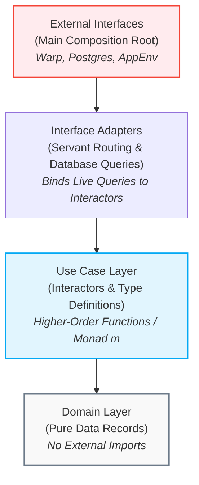

# Research Report: Functional Clean Architecture in the RealWorld Backend via Higher-Order Functions

* **Author:** Technical Research Group
* **Date:** May 19, 2026
* **Topic:** Lightweight Clean Architecture in Haskell via Function Parameterization (Revisited Paradigm)

---

## 1. Executive Summary

This research report analyzes the second blog post, *"Clean Architecture Revisited"*, by Thomas Mahler. It maps out how the concepts presented in the article can be applied to simplify and decouple our RealWorld Conduit backend (`/backend`).

While our first report (`research.md`) outlined a transition using a heavy type-level algebraic effect framework (**Polysemy**), the "Revisited" post proposes a lightweight, purely functional alternative. Rather than introducing algebraic GADTs, template Haskell boilerplate, and GHC plugins, we can enforce Uncle Bob's **Clean Architecture Dependency Rule** simply by leveraging Haskell's first-class support for **higher-order functions** (passing functions as arguments) and the **Handle/Service Pattern**.

By parameterizing our Use Case Interactors with abstract query actions, we achieve:
1. **Minimal Boilerplate:** No GADTs or Template Haskell macros. Code remains plain Haskell.
2. **Zero Compile-Time & Runtime Penalty:** Execution relies on direct, high-performance function calls, completely avoiding the dictionary passing and type-level routing overhead of Polysemy.
3. **Pure, Framework-Free Testability:** Use cases can be tested by passing simple, pure mock functions or stubs, isolating domain logic entirely from databases and network layers.

---

## 2. Deciphering the Blog Post: Clean Architecture via Functions

In *"Clean Architecture Revisited"*, Thomas Mahler reviews a pagination-based REST client that searches for books from the OpenLibrary API. He reflects on how an off-by-one error was introduced into his paging logic and details the obstacles he faced when attempting to write unit tests for it.

### The Problem: Monolithic Coupling

In his initial implementation, the core logic `searchBooks` directly called `getBookPage`, which performed real network IO (`httpJSON`). This tightly coupled the search logic to GHC's IO system and the external API. As a result, writing offline, stable unit tests was impossible without setting up elaborate mock networks.

### The Solution: Higher-Order Functions

Rather than reaching for a comprehensive algebraic effect library, Mahler resolved this coupling using standard functional programming techniques: **Parameterizing the use case with its dependencies**.



1. **Define the Interface Type:** Define the dependency signature as a simple type signature in the Use Case layer:
   ```haskell
   type PageAccess = String -> Natural -> Natural -> IO BookResp
   ```
2. **Parameterize the Interactor:** Add the signature as a parameter to the interactor:
   ```haskell
   searchBooks :: PageAccess -> Natural -> Natural -> String -> IO [Book]
   ```
3. **In-Memory Testing:** Test the interactor offline by passing a pure mock function (`mockBookPageImpl`) that runs in memory:
   ```haskell
   let mockSearch = searchBooks (mockBookPageImpl 100) 5 10
   ```
4. **Production Routing:** Execute in production by passing the real network-bound client (`getBookPage`):
   ```haskell
   let openLibrarySearch = searchBooks getBookPage 10 10
   ```

By applying this technique, the domain logic has zero dependencies on external HTTP systems, yet the code is structured without any heavyweight monad transformers or effect wrappers.

---

## 3. Applying the "Revisited" Approach to Our RealWorld Backend

Applying this paradigm to the `/backend` codebase allows us to decouple our Servant handlers from Persistent/Postgres while keeping our lightweight, high-performance `effectful` stack.

Instead of writing a custom Polysemy GADT and interpreters, we parameterize our Use Case Interactors using either **direct function arguments** or a **Record of Functions (Handle/Service Pattern)**.

### The Handle Pattern for Grouping Dependencies

For complex entities with multiple database actions (e.g., creating, reading, updating, and deleting articles), we can group query functions into a record type defined in the Use Cases layer:

```haskell
module UseCases.User.Service where

import DB.Schema.Type (UserId)
import Entity.User.Api (UserResponse)

-- Define the service interface in the Use Cases Layer
data UserService m = UserService
  { getUserById :: UserId -> m (Maybe UserResponse)
  , deleteUser  :: UserId -> m ()
  }
```

---

## 4. Case Study: Refactoring the `Tag` Route

To illustrate the simplicity of the higher-order function approach, let us refactor our tag list retrieval.

### Step 1: The Use Cases Layer (Pure Interactor)

In `UseCases/Tag/GetList.hs`, we define a type representing our database operation and parameterize our Use Case Interactor.

```haskell
module UseCases.Tag.GetList where

import Data.Text (Text)

-- Define the abstract query signature in the Use Cases Layer
type GetTagsAction m = m [Text]

-- The Use Case Interactor is a higher-order function
getTagListUseCase :: (Monad m) => GetTagsAction m -> m [Text]
getTagListUseCase getAllTags = do
  -- Pure validation or business operations can be performed here
  getAllTags
```

### Step 2: The Interface Adapters Layer (Servant Binding)

In our Servant routing module (`InterfaceAdapters/Controllers/Tag.hs`), we run the interactor. We resolve the dependency by passing the concrete Esqueleto database call `runDB getTags` directly into the interactor.

```haskell
module InterfaceAdapters.Controllers.Tag where

import Servant (NamedRoutes)
import Api.Tag.Web.Type
import Common.Type.App (App)
import DB.Util (runDB)
import Entity.Tag.Api (TagListResponse (..))
import Entity.Tag.Query (getTags) -- The raw Persistent query
import UseCases.Tag.GetList (getTagListUseCase)

-- Route Controller
tagController :: S.ServerT (NamedRoutes TagRoute) App
tagController = TagRoute
  { getTagList = getTagListHandler
  }

-- The controller feeds the database call into the Use Case
getTagListHandler :: App TagListResponse
getTagListHandler = do
  tags <- getTagListUseCase (runDB getTags)
  return $ TagListResponse tags
```

### Step 3: Pure Offline Testing

In our test suite (`test/Spec.hs`), we test the business logic of our use case without configuring database pools or mock servers. We pass a pure `Identity` or `State` action:

```haskell
module Test.Spec where

import Test.Hspec
import UseCases.Tag.GetList (getTagListUseCase)
import Data.Functor.Identity (Identity(..))

spec :: Spec
spec = describe "Tag Use Case" $ do
  it "retrieves tags completely in-memory" $ do
    let mockGetTags = return ["haskell", "functional", "clean-architecture"]
    
    -- Execute in the Identity monad (pure)
    let result = runIdentity $ getTagListUseCase mockGetTags
    
    result `shouldBe` ["haskell", "functional", "clean-architecture"]
```

---

## 5. Architectural Comparison

This table evaluates the three options for structuring our RealWorld backend:
1. **Current Stack:** Direct database execution via `runDB` in Servant handlers.
2. **Design 1 (Polysemy):** Complete separation using algebraic GADT effects.
3. **Design 2 (Revisited):** Decoupling via Higher-Order Functions / Handle Pattern.

| Metric | Monolithic Stack (Current) | Polysemy clean stack (Design 1) | Higher-Order / Handles (Design 2) |
| :--- | :--- | :--- | :--- |
| **Separation of Concerns** | Moderate. Servant handlers execute Esqueleto code directly. | **Absolute.** Core rules have zero awareness of external frameworks. | **Absolute.** Core rules are fully decoupled from database layers. |
| **Testing Simplicity** | Harder. Requires active database connection pools. | **Trivial.** swapped with mock GADT interpreters. | **Trivial.** Swapped by passing pure functions / stubs. |
| **Boilerplate & GHC Overhead** | **Very Low.** Minimal boilerplate. | High. Requires GADTs, Template Haskell, and GHC plugins. | **Very Low.** Plain Haskell functions and standard record types. |
| **Performance Cost** | **Zero.** Direct compiler inlining. | Low overhead, but carries type-level dictionary passing costs. | **Zero.** Standard function invocation optimized by GHC. |
| **Learning Curve** | Low. Familiar `ReaderT` / IO patterns. | High. Requires expertise in algebraic effects and type signatures. | **Low.** Standard functional programming principles. |

---

## 6. Refactoring Action Plan

Should we implement this lightweight transition, the process involves the following sequential tasks:

- [ ] **Phase 1: Identify Use Case Boundaries**
  - Map each Servant route to an atomic Use Case Interactor.
- [ ] **Phase 2: Extract Type Signatures**
  - Define type signatures for database operations (e.g., `type GetUserAction m = UserId -> m (Maybe User)`) in a corresponding `UseCases/` module.
- [ ] **Phase 3: Re-route Servant Handlers**
  - Refactor handlers in `Api/` to serve as "Interface Adapters." They will call `UseCases` interactors, passing live `runDB` actions as arguments.
- [ ] **Phase 4: Implement In-Memory Tests**
  - Write Hspec unit tests for all Use Case Interactors, passing pure mock functions to ensure 100% database-free test coverage.

---

## 7. Conclusion

Thomas Mahler’s revisited article highlights an essential truth in functional software design: **Clean Architecture does not require complex frameworks.**

By transitioning our backend from direct database execution to a decoupled, higher-order parameterization style, we obtain all the testability and modularity benefits of Clean Architecture. We achieve this using basic Haskell primitives—higher-order functions and record types—without introducing the compilation overhead, runtime penalty, or boilerplate associated with algebraic effect libraries like Polysemy.
