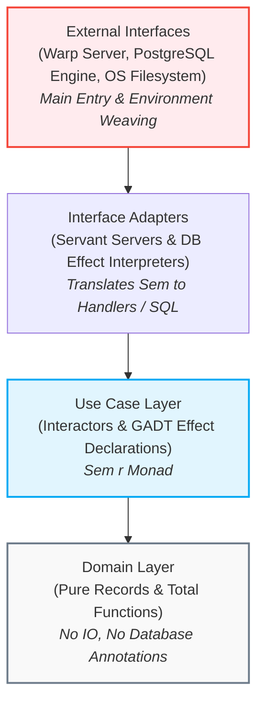

# Research Report: Transitioning the RealWorld Backend to Polysemy Clean Architecture

* **Author:** Technical Research Group
* **Date:** May 19, 2026
* **Topic:** Implementing Uncle Bob's Clean Architecture in Haskell using Algebraic Effects (Polysemy) based on Thomas Mahler's paradigm.

---

## 1. Executive Summary

This research report provides an analysis of the blog post *"Lambda is not a four letter word - Implementing Clean Architecture with Haskell and Polysemy"* by Thomas Mahler and outlines a concrete roadmap for applying its architectural principles to the RealWorld Conduit backend (`/backend`).

Currently, the backend utilizes an effect stack powered by the modern `effectful` library. While highly performant, it mixes concerns across database persistence, validation, and web routing. By transitioning to a structured **Polysemy-driven Clean Architecture**, we can isolate core business rules (Domain and Use Cases) from external technical frameworks. This separation yields several key benefits:
1. **Isolated Testability:** Business logic can be tested entirely in-memory, without mock database engines, filesystem configurations, or network setups.
2. **Framework Decoupling:** Database schemas and queries are separated from API routes, enabling database backend migration (e.g., swapping PostgreSQL for SQLite or an in-memory store) with zero changes to use-case code.
3. **Declarative APIs:** Servant endpoints map directly to atomic, reusable **Use Case Interactors**, streamlining the overall flow of control.

---

## 2. Deciphering the Blog Post: Clean Architecture via Polysemy

Thomas Mahler’s article demonstrates how to build an exceptionally clean backend service by utilizing **algebraic effect systems** (specifically the `polysemy` library) to enforce Robert C. Martin's (Uncle Bob) **Clean Architecture** guidelines.

### The 4-Layer Hierarchy and the Dependency Rule

The core principle is **The Dependency Rule**: *source code dependencies must point inwards*. Inner circles must have no awareness of the details defined in outer circles.



1. **Domain Layer (Innermost):** Pure data types and total functions. It contains no reference to Servant, Persistent, database engines, or IO.
2. **Use Case Layer:** Holds application-specific business rules and orchestrates the flow of data to and from domain entities. All interactions with external services (database, configuration, logging) are **declared** as abstract **algebraic effects (GADTs)** rather than executed directly.
3. **Interface Adapters Layer:** Contains concrete implementations of algebraic effects (interpreting GADTs into concrete Persistent/Esqueleto queries) and web controllers (routing web payloads to Use Case Interactors).
4. **External Interfaces (Outermost):** Concrete implementation details such as the web server (Warp), database connection pools, filesystem, and global application entry points.

### The Role of Algebraic Effects

Algebraic effect systems separate effectful programs into three distinct roles:
*   **Effect Declaration:** Defined in the Use Cases layer using GADTs representing operations (e.g., `getKvs`, `insertKvs`).
*   **Effect Usage:** Business logic written inside the `Sem r` monad (where `r` is a list of allowed effects), utilizing generated smart constructors.
*   **Effect Interpretation:** Implemented in the Adapters layer, converting GADT constructors into concrete operations. Swapping between database engines or mock layers is accomplished by changing the interpreter functions at the application's assembly point.

---

## 3. Current Architecture of the RealWorld Backend

The current codebase in `/backend/src` is structured as follows:

```
src/
├── Api/              -- Servant routes and handlers
├── Common/
│   └── Type/
│       ├── App.hs     -- Defines the App monad stack via 'effectful'
│       └── Config.hs  -- System configuration types
├── DB/
│   ├── Schema/        -- Database schemas and migrations
│   └── Util.hs        -- runDB SQL utility helper
└── Entity/            -- Domain entities and direct Esqueleto SQL queries
```

### Current `App` Monad and Database Interaction

In `Common/Type/App.hs`, the core monad stack is defined as:
```haskell
type App = Eff '[Reader AppEnv, Error S.ServerError, IOE]
```
In `DB/Util.hs`, database queries are run using the helper:
```haskell
runDB :: SqlPersistT IO a -> App a
runDB query = do
  env <- ask @AppEnv
  liftIO $ runSqlPool query env.appPool
```

API handlers under `Api/` call database query functions directly (e.g., `Api.Tag.Web.Handler`):
```haskell
getTagListHandler :: App TagListResponse
getTagListHandler = do
  tags <- runDB getTags
  return $ TagListResponse tags
```

### Architectural Assessment

While the current `effectful` library is highly performant and modern, it introduces the following challenges from a Clean Architecture perspective:

1. **Direct Coupling to SQL/Persistent:** API handlers call database queries directly. This couples the high-level request-handling logic to the database layer (Esqueleto/Persistent structures and Postgres schemas).
2. **Framework-Dependent Testing:** Testing handlers requires a running database connection pool, necessitating a live PostgreSQL database or complex mock infrastructures during unit testing.
3. **Lack of Use Case Interactors:** HTTP parsing, input validation, database transactions, and Servant response construction are bundled in single handler functions, reducing logic reusability.

---

## 4. Proposed Clean Architecture Layout

A clean architecture transition reorganizes the codebase into four strict concentric layers:

```
src/
├── Domain/                 -- PURE DOMAIN (No DB annotations, no Servant)
│   ├── User.hs             -- Pure User records and pure domain logic
│   └── Tag.hs              -- Pure Tag structures
│
├── UseCases/               -- APPLICATION BUSINESS RULES
│   ├── KVS.hs              -- GADT algebraic effect declarations
│   ├── User/
│   │   ├── Repository.hs   -- UserRepository GADT effect
│   │   └── Register.hs     -- Use case interactor for user registration
│   └── Tag/
│       ├── Repository.hs   -- TagRepository GADT effect
│       └── GetList.hs      -- Use case interactor for tag list retrieval
│
├── InterfaceAdapters/      -- PROTOCOL TRANSLATORS
│   ├── Controllers/        -- Servant routing mapping to UseCases
│   │   ├── Auth.hs
│   │   └── Tag.hs
│   └── Repositories/       -- Polysemy database interpreters
│       ├── Postgres/
│       │   ├── User.hs     -- Translates UserRepository GADT into Esqueleto SQL
│       │   └── Tag.hs      -- Translates TagRepository GADT into Esqueleto SQL
│       └── InMemory/       -- Pure in-memory State interpreter for unit tests
│
└── ExternalInterfaces/     -- THE DETAILS
    ├── Main.hs             -- Configures Warp and PostgreSQL pool
    └── Application.hs      -- Weaves Polysemy interpreters and boots Servant
```

---

## 5. Case Study: Refactoring the `Tag` Route

The following example demonstrates how to refactor the Tag retrieval endpoint.

### Step 1: The Use Cases Layer (Effect and Interactor)

In `UseCases/Tag/Repository.hs`, the GADT effect is declared:

```haskell
module UseCases.Tag.Repository where

import Data.Text (Text)
import Polysemy

-- Declare the abstract DB operation
data TagRepository m a where
  GetAllTags :: TagRepository [Text]

-- Auto-generate 'getAllTags' smart constructor
makeSem ''TagRepository
```

In `UseCases/Tag/GetList.hs`, the Use Case Interactor is defined:

```haskell
module UseCases.Tag.GetList where

import Data.Text (Text)
import Polysemy
import UseCases.Tag.Repository

-- Pure use case logic for listing tags
getTagListUseCase :: (Member TagRepository r) => Sem r [Text]
getTagListUseCase = do
  getAllTags
```

### Step 2: The Interface Adapters Layer (Interpreters and Web Controllers)

#### Production Postgres Interpreter:
In `InterfaceAdapters/Repositories/Postgres/Tag.hs`:

```haskell
module InterfaceAdapters.Repositories.Postgres.Tag where

import Database.Esqueleto.Experimental (runSqlPool, select, unValue)
import Database.Persist.Sql (ConnectionPool)
import Entity.Tag.Query (getTagsSQL)
import Polysemy
import Polysemy.Reader
import UseCases.Tag.Repository

-- Translate TagRepository actions into concrete SQL pool operations
runTagRepositoryPostgres :: (Member (Embed IO) r, Member (Reader ConnectionPool) r)
                         => Sem (TagRepository : r) a 
                         -> Sem r a
runTagRepositoryPostgres = interpret \case
  GetAllTags -> do
    pool <- ask @ConnectionPool
    embed $ runSqlPool (map unValue <$> select getTagsSQL) pool
```

#### In-Memory Mock Interpreter for Testing:
In `InterfaceAdapters/Repositories/InMemory/Tag.hs`:

```haskell
module InterfaceAdapters.Repositories.InMemory.Tag where

import Data.Text (Text)
import Polysemy
import UseCases.Tag.Repository

-- Run TagRepository against a simple statically provided list of tags
runTagRepositoryInMemory :: [Text] 
                         -> Sem (TagRepository : r) a 
                         -> Sem r a
runTagRepositoryInMemory mockTags = interpret \case
  GetAllTags -> return mockTags
```

#### Web Controller mapping routes to Use Cases:
In `InterfaceAdapters/Controllers/Tag.hs`:

```haskell
module InterfaceAdapters.Controllers.Tag where

import Polysemy
import Servant (NamedRoutes)
import Api.Tag.Web.Type
import Entity.Tag.Api (TagListResponse (..))
import UseCases.Tag.GetList (getTagListUseCase)
import UseCases.Tag.Repository

-- Define our Servant Server utilizing our Polysemy stack
tagController :: (Member TagRepository r) => S.ServerT (NamedRoutes TagRoute) (Sem r)
tagController = TagRoute
  { getTagList = getTagListHandler
  }

getTagListHandler :: (Member TagRepository r) => Sem r TagListResponse
getTagListHandler = do
  tags <- getTagListUseCase
  return $ TagListResponse tags
```

### Step 3: The External Interfaces Layer (Assembly)

In the application assembly module, effects are woven together using standard function composition:

```haskell
module ExternalInterfaces.ApplicationAssembly where

import Database.Persist.Sql (ConnectionPool)
import Polysemy
import Polysemy.Reader
import Polysemy.Error
import Servant
import InterfaceAdapters.Controllers.Tag (tagController)
import InterfaceAdapters.Repositories.Postgres.Tag (runTagRepositoryPostgres)

-- Hoist the Polysemy Sem monad into Servant's Handler
interpretServer :: ConnectionPool 
                -> Sem '[TagRepository, Reader ConnectionPool, Error ServerError, Embed IO] a 
                -> Handler a
interpretServer pool sem =
  sem
    & runTagRepositoryPostgres
    & runReader pool
    & runError @ServerError
    & runM
    & liftToHandler
```

---

## 6. Comprehensive Architectural Comparison

The following table summarizes the structural trade-offs:

| Architectural Metric | Our Current Stack (`effectful` semi-monolithic) | Proposed Clean Stack (`polysemy` layered) |
| :--- | :--- | :--- |
| **Separation of Concerns** | Moderate. Web routing has direct dependencies on the persistence engine and SQL types. | **Absolute.** Business rules have zero awareness of Postgres, Persistent, or HTTP protocols. |
| **Unit Testing Simplicity** | Harder. Requires active connection pools or complex database mocking strategies. | **Trivial.** The production database interpreter is swapped with an in-memory interpreter in test files. |
| **Monad Stack Flexibility** | Good. High-performance monad stack that utilizes GHC thread-state operations. | **Exceptional.** Allows granular control and reordering of separate, composable effects. |
| **Boilerplate overhead** | Low. Directly write query functions and run transactions via `runDB`. | Moderate. Requires GADT declarations and GHC template expansion. |
| **Performance (GHC level)** | **Extremely high.** Native performance matching raw IO execution speed. | High, but carries slight runtime overhead due to type-level dictionary passing (minimized via GHC optimization plugins). |

---

## 7. Refactoring Checklist and Action Plan

The transition process can be executed in the following sequential phases:

- [ ] **Phase 1: Domain Isolation**
  - Reorganize models from `DB/Schema/Type.hs` into pure Domain structures, keeping Persistent models isolated within the database layer.
- [ ] **Phase 2: Add Dependencies**
  - Add `polysemy` and `polysemy-plugin` to `package.yaml` and configure compiler options.
- [ ] **Phase 3: Define GADT Effects**
  - Create repositories (e.g., `UserRepository`, `ArticleRepository`) in `UseCases/` using GADT syntax.
- [ ] **Phase 4: Adapt API Routes**
  - Move endpoint handlers to `InterfaceAdapters/Controllers` and generalize signatures from `App a` to `Sem r a`.
- [ ] **Phase 5: Implement DB Interpreters**
  - Relocate existing Esqueleto queries under `InterfaceAdapters/Repositories/Postgres` and bind them to concrete effect interpreters.
- [ ] **Phase 6: Integration and Verification**
  - Hoist Servant routes to weave interpreters and implement pure unit test suites in `test/`.

---

## 8. Conclusion

Adopting Thomas Mahler’s Polysemy Clean Architecture structure offers a highly decoupled, modular, and maintainable framework for the RealWorld Conduit backend. By strictly separating Domain rules from technical implementation details, the codebase gains strong isolated testability and adapts easily to external changes (such as database or framework upgrades). 

While the current `effectful` implementation provides excellent runtime performance, refactoring toward a concentric layer model utilizing algebraic effects significantly enhances codebase architecture, modular design, and standard compliance.
